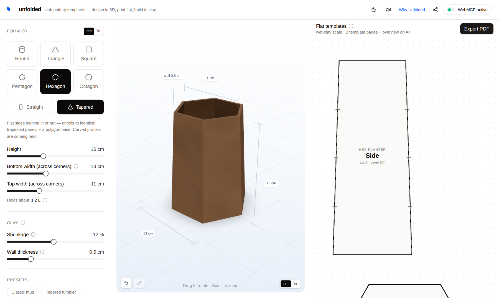

# Unfolded

**Slab pottery templates — design in 3D, print flat, build in clay.**

**Live: [tryunfolded.com](https://tryunfolded.com)** · guide at
[/webmcp](https://tryunfolded.com/webmcp) · story at
[/why](https://tryunfolded.com/why)

[](https://github.com/lucaguglielmi/Unfolded-Web-MCP/actions/workflows/deploy.yml)
[](https://www.npmjs.com/package/webmcp-profiler)
[](./LICENSE)



Unfolded lets potters design slab-built forms (mugs, tumblers, vases) as parametric 3D
objects and turns them into true-scale printable templates to cut, tape, and lay on a
clay slab. Every dimension is shrinkage-compensated for your clay body and developed
along the slab mid-surface, so the fired piece matches the design.

The whole app is **WebMCP-native**: it registers its editing tools on
`document.modelContext`, so an agent (e.g. ChatGPT's in-app browser) can inspect and
edit the same design you see on screen — *"make it a 350 ml tumbler and use my
stoneware at 12% shrinkage"* — while the 3D preview and templates update live.

The specs and design documents live in [docs/](./docs).

## Why this exists

Slab building is the most common hand-building technique in ceramics, and its
paper step is still manual: potters draw templates on cereal boxes, wrap paper
around forms, and do the sizing math by hand. Two errors are endemic to that
math, and both ruin pieces only after the firing:

- **Shrinkage is scaled the wrong way.** Clay shrinks ~10–13% from wet to fired,
  so a template must be scaled up by `1/(1−s)` — but the intuitive `1+s` is what
  most people reach for, and at 12% shrinkage it leaves every dimension ~1.6%
  short. A lid that no longer fits, a set of mugs that don't match.
- **Walls are measured on the wrong surface.** A slab bends along its middle, so
  a wrapped wall must be developed on the mid-surface (`r − t/2`); using the
  outer dimension makes the wall come out too long and the seam overlap.

Unfolded encodes all of this — and more — under the hood: shrinkage scaled the
right way, walls developed on the slab mid-surface, exact interior capacity
(volume is linear in height, so *"make it hold 350 ml"* has a closed-form
answer), true miter bevels for tapered faceted forms, and page tiling with
registration ticks and a calibration bar on every sheet. You drag a slider; the
math stays right. The audience is specific — hand-builders, ceramics teachers,
studio classes — and the output is physical: a PDF that prints at 100% scale,
with a ruler on the page to prove it, that gets cut out and laid on clay.

The agent is not a gimmick on top: sizing questions are exactly what potters
ask in words (*"a mug that holds a full pour-over"*, *"my new clay shrinks
14%, fix my templates"*) and exactly what the geometry can answer precisely.
WebMCP is the bridge between those two facts.

## The non-trivial WebMCP parts

The short list of what makes this more than tools bolted onto a page
(everything below is in [`src/mcp/`](./src/mcp/) and covered by the
committed e2e suite):

- **Fourteen tools with real contracts** — zod-validated inputs exported as JSON
  Schema, current-draft descriptors (top-level titles, `readOnlyHint` where
  truthful, host cancellation signals honored), and graceful `isError` results
  that include the unchanged state, plus a parseable `structuredContent`
  half (`tool-result/1`): `{ ok, message, state, … }`.
- **Every tool that changes the design returns the full new state** (PDF
  export included), so the agent never needs a follow-up read. Snapshots are
  pure and carry a permanent `designUrl`; the *return channel* is a separate,
  non-mutating tool — `create_live_handoff` mints a single-use
  `liveHandoffUrl` and fails closed, so the potter's own browser follows the
  agent's session.
- **A solver, not just setters** — `set_capacity` computes the exact height for
  a target volume in one call instead of letting the agent iterate.
- **The agent sees what the potter sees** — `get_preview_image` returns the
  live WebGL canvas as image content, deliberately compact (~7 KB JPEG ≈
  1.7 K tokens per look; it was a 130 KB PNG until the built-in profiler
  flagged it as the costliest payload in the agent loop).
- **Never-give-up registration** — hosts inject `modelContext` at wildly
  different times (ChatGPT only when the person engages the agent), so the app
  watches forever: fast polling, then a heartbeat (paused in hidden tabs), plus
  focus/visibility re-checks, across `document`/`navigator`/`window`, with a
  `provideContext` fallback for hosts without `registerTool`.
- **An honest connection model** — the three-state pill never guesses: direct
  registration, an explicit agent-minted link signal, or nothing.
- **Human and agent are true peers** — same store, same validation, shared
  undo/redo over both actors' edits, and concurrent PDF exports counted, not
  flag-locked.
- **Live cross-device sessions — scan, tap, or speak** — a QR or agent link
  carrying a single-use join token (or a spoken 6-character code) pairs any
  two screens into one session: a Durable Object per session, WebSocket
  hibernation, patches in the share-link vocabulary, per-field
  last-write-wins. No URL ever carries a durable capability — invitations
  burn on first use.

## Verify in 60 seconds

The live app is **<https://tryunfolded.com>** — no account, no setup; open it
in ChatGPT's built-in browser and the agent has all 14 tools immediately.
To verify the repo from a clean checkout:

```bash
npm ci
npx playwright install chromium   # for the e2e suites
npm run lint
npm test          # 282 unit tests: geometry, schemas, sync client, profiler
npm run build
npm run e2e       # real Chromium against the production bundle + a simulated WebMCP host
```

Two deeper suites exercise the live-session backend; each starts its own
local Cloudflare Worker (`wrangler dev --local`, bundled as a dev
dependency — nothing to install or configure):

```bash
npm run e2e:worker    # Durable Object protocol smoke: hello/patch/resync, join tokens
npm run e2e:pairing   # two real browsers pairing, converging, and surviving offline
```

Three prompts to try against the live site in ChatGPT, and what should happen:

1. *"What am I designing right now?"* — one `describe_project` call; the agent
   answers with the current shape, sizes, capacity in ml, and a share link.
2. *"Make it hold about 350 ml and show me how it looks."* — `set_capacity`
   solves the height in closed form (no guess loop), then `get_preview_image`
   returns the same 3D view the potter sees.
3. *"Export the PDF for A4."* — `export_templates` downloads a multi-page,
   100%-scale template with a calibration ruler; the agent reports the page count.

For development: `npm run dev` starts the local server; `npm run perf`
benchmarks every tool's execution time and payload size.

Open the app in a WebMCP-capable browser:

- **ChatGPT's internal browser** — WebMCP works out of the box (note: tapping a link
  in the chat opens ChatGPT's *ordinary* in-app browser instead — a separate session
  without WebMCP)
- **Google Chrome (desktop & Android)** — enable `chrome://flags/#enable-webmcp-testing`;
  when the app detects real Chrome without WebMCP it shows a one-time dismissible tip
  with that address ready to copy

## Agent connection states

The header's connection button carries two status dots — agent (WebMCP) and live
sync — and tells the truth about both. The agent states:

| State | Dot | Meaning |
|---|---|---|
| **WebMCP active** | pulsing green | The API is available in *this* tab (`document`/`navigator`/`window.modelContext`) and tool registration succeeded — human and agent share one live session. |
| **Opened from ChatGPT** | solid green | This tab has no direct WebMCP, but the design arrived through an agent-minted link (`?via=chatgpt`, set only on `liveHandoffUrl`s) — provenance, not pairing. A live handoff link also carries a single-use join token, so tapping it makes this tab a live follower of the agent's session; the second dot confirms that separately. |
| **WebMCP** | grey | Neither could be confirmed — the button just names the capability; tapping it explains how to connect. |

A ChatGPT connection is shown **only** on that explicit link signal — never inferred
from the user agent, referrer, screen size, or being inside an in-app browser. Direct
registration (or any actual tool call) always upgrades the state to active.

**Launch in ChatGPT, one tap.** In every agent state — including when this browser's
own WebMCP is on — the panel offers two actions that both carry a ready-made
instruction plus a fresh single-use pairing code
(15-minute TTL): **Open in ChatGPT** injects it straight into a new chat via
`chatgpt.com/?q=` (on phones the link hands off into the ChatGPT app), and **Copy
prompt** puts the same text on the clipboard for any other assistant. Sending it makes
the agent open the site, call `join_session` with the code, and become a live peer of
the device that minted it — one tap from "no agent" to a paired conversation.

Detection is built for real agent hosts: it watches for the API forever (fast polling
at first, then a slow heartbeat, plus focus/visibility re-checks) because hosts like
ChatGPT inject `modelContext` only when the person engages the agent. Registration
follows the current WebMCP draft — `document.modelContext.registerTool` awaited,
all-or-nothing under one AbortController, active only after the last tool resolves,
and re-registered cleanly if the host replaces the registry. Legacy hosts keep
working through a clearly-separated compatibility layer (`navigator`/`window`
locations, `provideContext`, void returns); any actual tool call flips the state
to active. For manual
testing without an agent, registered tools are exposed on the console as
`__unfoldedTools` (e.g. `__unfoldedTools.set_capacity.execute({capacityMl: 350})`).

The in-app guide at [`/webmcp`](https://tryunfolded.com/webmcp)
explains all of this to visitors, with live connection status for their own browser.

## WebMCP tools

Registered on `document.modelContext` per the current WebMCP draft (legacy
`navigator`/`window` locations accepted for compatibility — see
[`src/mcp/tools.ts`](./src/mcp/tools.ts)):

<!-- keep in sync with TOOL_SUMMARIES in src/mcp/tools.ts (the single source
     the /webmcp page renders) — README can't import, so this table is manual -->
| Tool | What it does |
|---|---|
| `describe_project` | Read the current design, clay, template pieces, capacity (ml), and its permanent design link |
| `open_model` | Open a design from a share link the user pastes in chat, then keep editing it |
| `update_form` | Change shape / taper / facets / height / diameters (fired mm) — any shape can be straight or tapered |
| `set_clay` | Change shrinkage % and wall thickness |
| `set_units` | Switch display units between cm and inches — UI, warnings, and the printed PDF |
| `set_capacity` | Solve the height for a target interior volume ("make it 350 ml") |
| `get_template_summary` | Template layout, per-piece dimensions, exact PDF page count |
| `get_preview_image` | Compact JPEG snapshot of the live 3D preview (~7 KB, deliberately cheap to read) — the agent sees what the potter sees |
| `export_templates` | Generate and download the multi-page PDF (A4 / A3 / Letter) |
| `apply_preset` | Start from a preset (classic mug, tumbler, bud vase, hex planter) |
| `create_live_handoff` | Mint the single-use live link that continues this design on the potter's own screen — the default link after any edit |
| `join_session` | Pair this tab into a live cross-device session using the 6-character code from the potter's other device |
| `start_pairing` | Mint a 6-character code so the potter's other device can join this design's live session |
| `undo_last_change` | Revert the last change, whoever made it (up to 50 steps) |

UI and agent tools share the same zustand store and zod schemas, so human and agent
edits stay in sync in the same session. Every tool that changes the design returns
the full new state — including `capacityMl` (`set_capacity` solves the height for *"a 350 ml mug"*
in closed form) and `designUrl`, a permanent permalink.

**Two links, never confused.** `designUrl` reopens an independent copy: parameters
only, bookmarkable, printable, months later — it is also the address bar and the
printed QR. `liveHandoffUrl` comes only from `create_live_handoff`: the same
parameters plus `?via=chatgpt` and a single-use join token, so the tab that opens it
follows the agent's session both ways. The tool descriptions make the live link the
default for every newly created result link ("send me the link", "show me", "open
it"), to be returned verbatim — never the address bar; a permanent link is sent only
on an explicit bookmark/print/archive ask, and a failed mint yields no link at all.

Things to try in a WebMCP-capable browser:

> *"What am I designing right now?"*
> *"Make it a hexagonal planter, 18 cm tall and 14 cm wide."*
> *"My stoneware shrinks 13% — adjust and tell me the fired sizes."*
> *"Make it hold about 350 ml, show me how it looks, then export the PDF for Letter paper."*

## Sync live between devices

A design doesn't live in one chair — and the other chair needs no WebMCP,
just a browser. **Continue on another screen** (inside the header's connection button) shows
a QR and a copyable link carrying a **single-use join token**: the device
that opens it follows this design live, both ways, within about a second —
whoever made the edit. In ChatGPT it's automatic: **the agent's default
link after any edit is a live handoff** (`create_live_handoff`) — tap it and
the tab you're looking at stays current with the agent's hidden browser (and
your edits there appear in the agent's next read). Ask for a permanent link
only when you want an independent copy. The spoken **6-character code** sits
right beside the QR: read it aloud, or type it into ChatGPT *"join my desktop
session, code K7F-3QP"* (`join_session`); the reverse direction is
`start_pairing`. Phones freezing background tabs is expected: every
return to the tab reconnects and converges, and edits made offline are kept
and sent.

Invitations are honest capabilities: **single-use and short-lived** (a
link's token dies on first open or within 15 minutes; a code likewise), and
whoever uses one can edit that design live — nothing else. Privacy stays
simple: the design parameters are the only thing that ever leaves the
device, sessions are unlisted and expire after 30 idle days, and **no URL
ever carries a durable capability** — a used link degrades to a plain
design link, the address bar never holds a session, and the printed QR
stays parameter-only (a found template grants a copy, not entry to your
session).

Three ways this plays out: start on the desktop and continue with the agent
on the phone; start with the agent and bring the design to the desktop with
an agent-minted code; or months later, scan the QR printed **inside the
largest template piece** — it survives the overview page being binned — and
re-derive the same design for a new clay body.

## Share links

Every design is a URL. Query parameters describe the whole model, so a link like

```
https://<deployment-host>/?type=tapered&height=600&bottom=300&top=100&shrinkage=12&wall=5
```

opens the app with that exact form (`type` also accepts `triangle`, `square`,
`pentagon`, `hexagon`; `name`, `paper=A4|A3|Letter`, and `units=cm|in` work too — the
model itself stays metric, `units` only sets how measurements are displayed and
printed). After the first edit
the address bar live-tracks the design, the header's link button copies it, and the
`open_model` tool lets an agent continue from any pasted link. Links are
origin-independent — they survive domain changes — and parameter-only: opening
one grants a copy of the design, never entry to a live session.

## How the math works

Slab-built forms are developable surfaces, so templates come from closed-form
unrolling (no mesh solver): cylinders → rectangles, cone frustums → annular sectors,
prisms → flat panels, tapered prisms (pyramid frustums) → trapezoid panels with the
miter bevel recomputed for the lean of the faces.
Two pottery-specific corrections are applied — clay shrinkage scaling (`1/(1−s)`) and
mid-surface development (`r − t/2`). See
[`src/lib/geometry/unroll.ts`](./src/lib/geometry/unroll.ts).

## Built-in performance profiler

The repo also ships [`webmcp-profiler`](./packages/webmcp-profiler) — a
zero-dependency analyser for any WebMCP tool surface, on
[npm](https://www.npmjs.com/package/webmcp-profiler) with provenance. Open
the live app with `?perf=overlay` and every tool call is measured: wall
time, main-thread blocking, payload bytes and estimated tokens, and the
host+model "think time" between calls. Its first finding — the tools run in
single-digit milliseconds; an oversized preview payload was the real cost —
is fixed above. The package is a workspace here and the site imports its
source, so profiler and app change in the same pull request until the
package moves to its own repo. Design rationale:
[`docs/webmcp-profiler-spec.md`](./docs/webmcp-profiler-spec.md); next
release: [`docs/webmcp-profiler-0.2-spec.md`](./docs/webmcp-profiler-0.2-spec.md).

## Deploy

Hosted on Cloudflare (Workers static assets). Every push to `main` deploys via
GitHub Actions (`.github/workflows/deploy.yml`); it needs the `CLOUDFLARE_API_TOKEN`
and `CLOUDFLARE_ACCOUNT_ID` repo secrets. Manual deploy: `npm run build && npx wrangler deploy`.

Share links, WebMCP tools, and the app itself are origin-independent; the only
place the deployed domain is written down is `VITE_SITE_URL` in
[`.env.example`](./.env.example) (for the absolute `og:*` meta tags). That committed
file is the build's default; a git-ignored local `.env` overrides it. Every `VITE_`
value is inlined into the client bundle, so no `.env` here may hold a secret.

## License

[MIT](./LICENSE)
